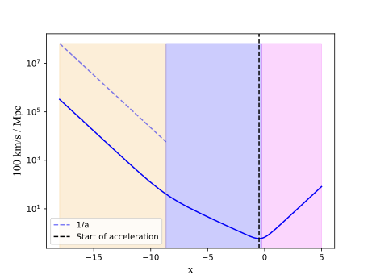
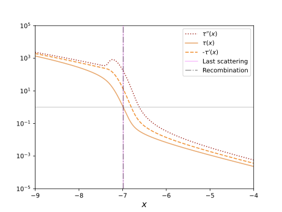
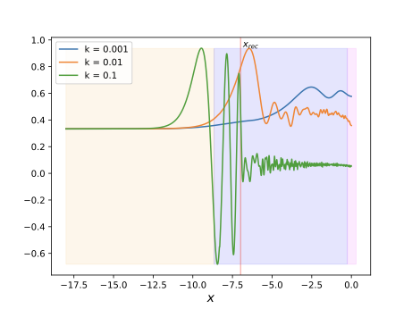
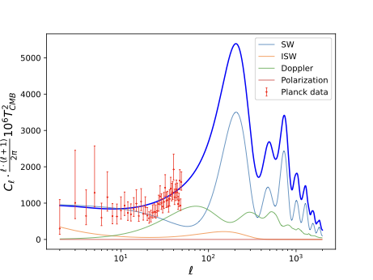

# Cosmological Simulation of the Universe's Evolution

## Overview
This repository contains a C++ implementation of a simplified ΛCDM cosmology simulation of the Universes evolution with the goal of predicting CMB and matter fluctuations desctribed in their power spectra.
The project is divided into four milestones which each center on different physical processes that go on to give our results. 

### Project structure
- 'src/' --   C++ implementation of necessary modules and of the four milestones; bacground, recombination, perturbations, and power spectrum.
- 'scripts/' --   Python plotting scripts for the milestones
- 'data/' --  Datasets required to run simulations
- 'figs/' --  Figures of the results generated
- 'docs/' --  Final report summarizing the project
- 'Makefile' --   Makefile to run the simulation


### Milestone 1 (m1): Background Cosmology
**The goal of m1 is to compute the expansion history of the Universe and model the evolution of the background densities of the various matter and energy components.**



One **result** from this milestone is the above plot of the conformal Hubble parameter evolving over time x (defined with respect to the scale factor, x=0 is today). M1 of the simulation shows that the expansion rate of the Universe slows down until the dotted vertical line, at this point the expansion rate accelerates and is predicted to continue accelerating. This simulation also tells us which eras of the Universe's history is dominated by various matter and energy components. The yellow region indicates radiation dominated era, blue is the matter dominated era, and pink is the dark energy dominated era. 

### Milestone 2 (m2): Recombination
**The goal of m2 is to simulate the recombination history of the Universe i.e. how baryonic matter went from consisting only of free electrons and protons to neutral hydrogen. This is the era when space went from being an optically dense medium where photons were highly constrained to an optically thin medium where photons could travel uninterrupted for millions of years.**



One **result** from this milestone is the above plot of the optical depth, $\tau$, and its derivatives of space over time. When $\tau < 1$ a medium is optically thin and transparent. This result shows the evolution of the optical depth of space during the era of Recombination. At the moment of complete recombination (vertical dashed line), the optical depth is 1 and reducing, and the ligth we observe as the CMB is emitted.

### Milestone 3 (m3): Perturbations
**The goal of m3 is to simulate the evolution of structure in the Universe. Specifically, how perturbations in a medium of baryons, photons, and dark matter predict large scale structure formation we see to day.**

This milestone explores the relationship with perturbations in cosmic fluid and structure formation by modellng for different 


One **result** from this milestone is the above plot of the Monopole, $\Theta_0$, of the CMB, which represents the average temperature of the CMB. The average temperature of the CMB is directly tied to the density perturbation of radiation (photons), and the result shows how the battle for gravity domination between photons, baryons, and dark matter affects the CMB temperature for different size scales (k modes).

In the radiation dominated era (yellow), perturbations in the photon-baryon fluid which made up space was stabilized due to radiation pressure. This prevented significant clustering of matter. As time progresses, density perturbations of cold dark matter and baryons grow, eventually creating significant oscillations in radiation density and at last decoupling baryons from photons. The blue region represents the matter dominated era, when baryons finally are decoupled from photons. The pink is the dark matter dominated era, where clustering of cold dark matter dominates the gravitational influence in the Universe. 

### Milestone 4 (m4): Power Spectrum
**The goal of m4 is the final goal of the project; it implements all milestone simulations to compute the CMB and the matter power spectrum**



One **result** from this milestone is the above plot of the theoretical angular CMB power spectrum (dark blue curve). This result shows the fluctuation power of the the CMB temperature as a function of angular scales, where low $\ell$ represent large scales. The red bars represent real data from Planck 2018, which corroborates our simulation for large scales. The curves underneath the power spectrum represent the contribution of the Sachs-Wolfe term, the Integrated Sachs-Wolfe term and polarization to the power spectrum. (See docs/Report.pdf for more.)

## How to Run

### 1) Build
From the repository root, clean any previous build artifacts and compile the project:
```bash
make clean
make
```

This will produce an executable named ./cmb in your root directory.

### 2) Prepare output directory
The code will write txt results in an output folder. Create the following folders in your root directory:

```bash
mkdir -p output/{background,recombination,perturbations,power_spectrum,supernova}
```
### 3) Run

Execute the code in your root directory with 
```bash
./cmb
```
This will fill your output folder and print simulation information and sanity checks.
You should get the following files:

```
.output/
  background
    best_params_cosmology.txt
    cosmology.txt
  supernova
    working_data
      results_supernovafitting.txt
    results_supernovafitting.txt
  power_spectrum
    cells_Doppler.txt
    cells.txt
    cells_Polarization.txt
    cells_ISW.txt
    matter_transfer.txt
    cells_SW.txt
  perturbations
    perturbations_k0.01.txt
    perturbations_k0.001.txt
    perturbations_k0.1.txt
  recombination
    Xe_test.txt
    recombination.txt
```

### 4) (Optional) Plotting
Run any of the python files in 'scripts/' from their location.

### Dependencies
#### Core (C++)
- **C++ compiler:** `g++` (or `clang++`) with **C++11** support (`-std=c++11`)
- **GNU Make**
- **GSL** (GNU Scientific Library) + CBLAS (`-lgsl -lgslcblas`)

**GSL include/library paths**  
The `Makefile` is configured to look for GSL under `$(HOME)/local`:

```make
INC  = -I$(HOME)/local/include
LIBS = -L$(HOME)/local/lib -lgsl -lgslcblas
```
#### Python
- **numpy**
- **matplotlib** 
- **astropy**

## Credits and Data Sources
This project was developed for the course AST5220 - Cosmology II at the University of Oslo, taught by David Mota and Hans Arnold Winther. As this was a course assignment, provided scaffolding from https://github.com/HAWinther/AST5220-Cosmology was used.

The dataset data/planck/planck_cell_low.txt is retrieved from Planck 2018 data (https://arxiv.org/abs/1807.06209), and the data/supernova/Betoule_supernova.txt from Betoule et. al. (https://arxiv.org/abs/1401.4064).